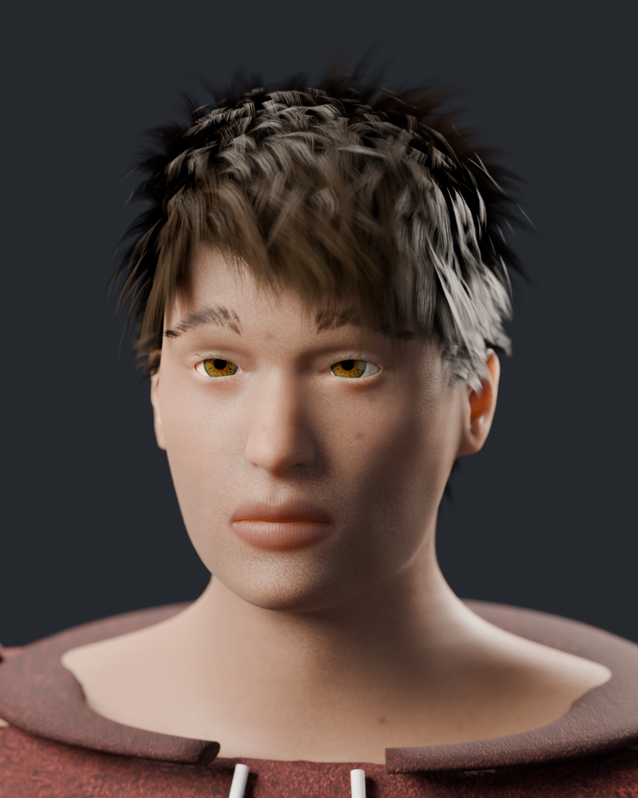
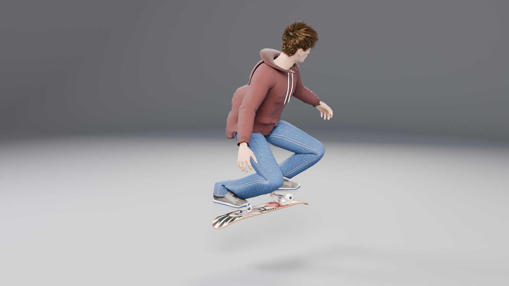
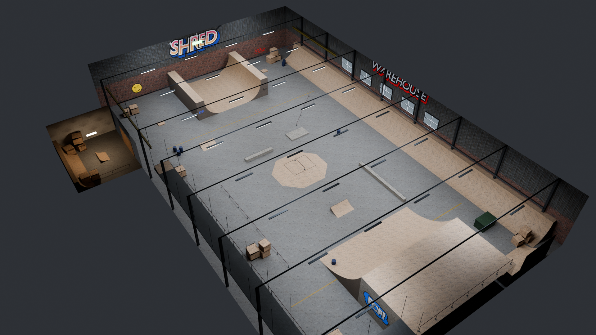
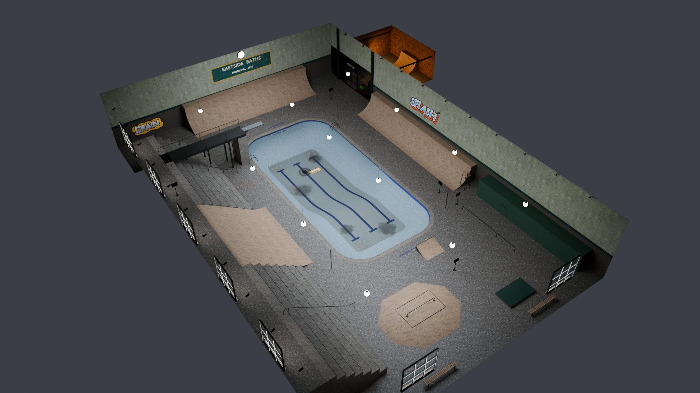
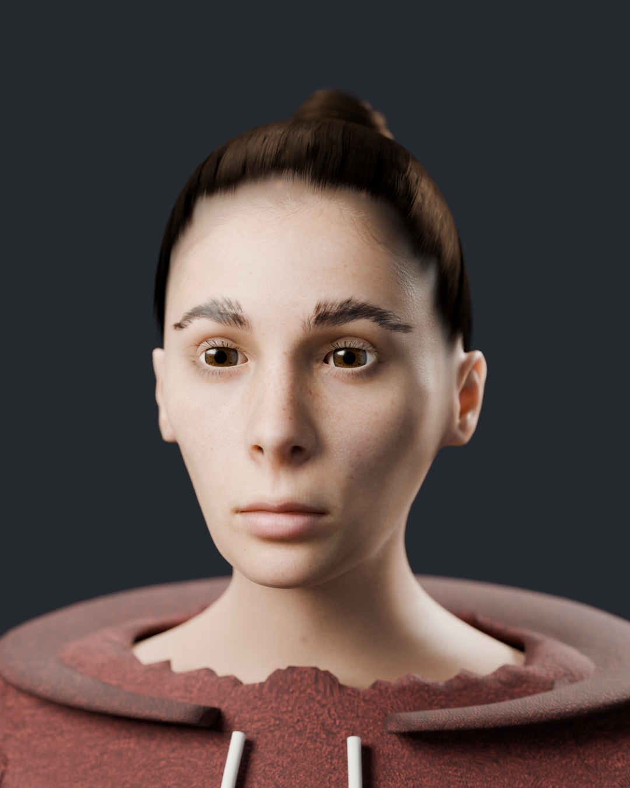
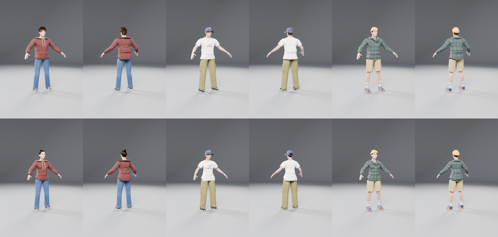

# Pro Skater: The Warehouse

**Play it live: https://skate-game-opus-5-5-blush.vercel.app**

A Tony Hawk's Pro Skater-style skateboarding game in Godot 4.7.2 (GDScript, Compatibility
renderer, web export), set in an original homage to the THPS1 Warehouse. Every 3D asset -
the skater, the board, the whole park and every prop - is built by Python scripts in
Blender 5.2 (`blender/`), exported as GLB (`assets/`) and loaded by the game. All sound is
synthesised in GDScript at startup.

| Face portrait (Cycles) | Skater mid-kickflip | The Warehouse |
|---|---|---|
|  |  |  |

Gameplay (recorded two-minute run, every goal completed): `evidence/two_minute_run.mp4`;
ragdoll bails and getups: `evidence/bail_showcase.mp4`. The **Skater** screen (C / Y on the
start screen) picks a male or female skater and their clothes: see Character builder.

A second park, **Eastside Baths** (a drained 1930s pool hall), is on the level select (Tab on
the start screen). It was built with the level kit and the steps in `docs/LEVELS.md`, which
is how further levels are made. See [Levels](#levels).

## Commands

| What | Command (run from the project root) |
|---|---|
| Rebuild every 3D asset + renders, headless | `blender --background --python blender/build_all.py` |
| Export the web build (Thread Support off) | `tools/export_web.sh build/web` (the "Web" export plus one pack per kit-built level in `build/web/levels/`) |
| Serve it locally | `python3 -m http.server 8765 --directory build/web` then open http://localhost:8765/ |
| Build the native Windows version | `bash desktop/build_windows.sh` -> `build/windows/ProSkater.exe` and a zip (see [Windows build](#windows-build)) |
| Deploy (Vercel) | Automatic: the Vercel project is connected to this GitHub repo, so every push to `master` deploys to production (other branches and PRs get preview deployments). `vercel.json` runs `tools/vercel_build.sh`, which installs the official Godot 4.7.2 Linux binary (pinned SHA-512), imports the project and exports `build/web`. On the Hobby plan Vercel only deploys commits authored by the team owner's linked GitHub account. Manual deploy of a local export: `npx vercel link --yes --project skate-game-opus-5-5 --cwd build/web` then `npx vercel deploy --prod --yes --cwd build/web` |
| Run every test headless (11 suites, then the level select, the character builder, the builder with the level select, each kit-built level's suite and the Windows build's desktop layer: 17 suites) | `bash tests/run_all.sh` (results in `tests/results/`) |
| Make a new level | `python3 blender/levelkit/scaffold.py <id> "<Name>"`, then follow `docs/LEVELS.md` |
| Build one level (geometry, data, Cycles bake) | `blender --background --python blender/build_all.py -- --only <id>` |
| One level's park tests (scale, UVs, grinds, breakables, hidden area, pickups, the full run) | `godot --headless --path . --fixed-fps 60 -s tests/test_level.gd -- --level=<id>` |
| Clothing fit, every outfit pairing through all 25 clips (about 20 minutes) | `godot --headless --path . -s tests/test_outfits.gd -- --fps=30 --only=male` (and `--only=female`; `--pick=0,4` for single outfits, `--debug` for the worst vertex of each pair) |
| Close-ups of any clip on any skater | `godot --path . --resolution 900x900 -s tests/pose_shot.gd -- --skater=female,tee,cargo,hitop,cap --clip=all --tf=0,0.5,1 --out=/tmp/shots` |
| The builder in the web build (Chrome) | `python3 tests/web_check_builder.py http://localhost:8765/` |
| Frame-by-frame check of the run | `godot --path . --fixed-fps 60 --resolution 1920x1080 -s tests/frames.gd -- --autopilot=run --segment=windows` (segments: `start`, `rafter`, `wall_tape`, `windows`, `funbox`, `halfpipe`, `end`, or `all --every=6` for the whole run in about 4 minutes); then `python3 tests/frames_sheet.py /tmp/skate-work/frames/windows --flagged` for contact sheets |

The rebuild took about 8 minutes on an RTX 4080 for the Warehouse alone (assets about 3
minutes, Cycles renders the rest); with Eastside Baths it measured 14.5 minutes on the GPU
shared with other jobs (`tests/results/build_all_rebuild_check.txt`). With the character builder's second skater, wardrobe and renders (before Eastside Baths was merged in) it took
872 s on a shared machine (both skaters 243 s, the park 104 s, renders 525 s). `-- --fast` makes a quick low-quality pass; `-- --only board,park` rebuilds a subset.
The web build needs no special headers (single-threaded), and every path in it is relative.
It also carries the Godot AI editor plugin's small runtime helper (an autoload that let the
game be driven from the editor during development); it does nothing in the release build.
It uses a Godot 4.7.2 web template rebuilt from the 4.7.2-stable source with one small
Compatibility-renderer patch (`engine/patches/`: SSAO no longer triggers an unused mid-frame
depth copy, which cost about 3.4 ms a frame with 4x MSAA in Chrome on Windows);
`engine/build_web_template.sh` rebuilds it, and the Web preset points at
`engine/godot-4.7.2-web_nothreads_release-patched.zip`.
URL options: `?level=<id>` starts on that level, `?fps` shows an FPS counter, `?autopilot` plays the scripted two-minute run,
`?bench` records frame-time statistics for the run (`?quality=full` disables adaptive quality),
`?skater=female,tee,cargo,hitop,cap` skates that skater for the visit (`--skater=` on the
command line).

## Controls

Shown on the start screen and in the pause menu.

| Action | Keyboard | Gamepad |
|---|---|---|
| Steer / push (Up) / brake (Down) | W A S D or arrow keys | Left stick or D-pad |
| Ollie (hold to crouch, release to pop) | Space | A / Cross |
| Flip trick + direction | J | X / Square |
| Grab trick + direction (hold) | K | B / Circle |
| Grind (rail, ledge, coping, pipe, rafter) + direction | L | Y / Triangle |
| Spin in the air | Left / Right, Q / E | Left stick, LB / RB |
| Manual / Nose manual | Up, Down / Down, Up | Up, Down / Down, Up |
| Special trick (special meter full) | Left, Right + J | Left, Right + X |
| Pause / Restart run | Esc or P / R | Start / Back |
| Skater screen (start screen) | C | Y / Triangle |
| Instant replay (end screen) | V | X / Square |

The gamepad works through Godot's joypad input (the browser Gamepad API in the web build).

## Tricks and scoring (THPS rules)

| Trick | Points | Input |
|---|---|---|
| Kickflip | 100 | Flip + Left (or no direction) |
| Heelflip | 100 | Flip + Right |
| Pop Shove-It | 100 | Flip + Down |
| 360 Flip | 500 | Flip + Up |
| Indy | 200 + 120/s held | Grab + Right (or no direction) |
| Melon | 200 + 120/s held | Grab + Left |
| Nosegrab | 250 + 120/s held | Grab + Up |
| Tailgrab | 250 + 120/s held | Grab + Down |
| 50-50 | 100 + 150/s | Grind near a rail, ledge, coping, pipe or rafter |
| Boardslide | 150 + 150/s | Grind + Left/Right |
| Manual | 100 + 120/s | Up, Down |
| Nose Manual | 150 + 120/s | Down, Up |
| Spins | 180: 100, 360: 250, 540: 500, 720: 800, 900: 1200, 1080: 1600 | Left/Right or spin buttons in the air |
| **Tiger Claw Tre** (special) | 3000 | Special meter full: Left, Right + Flip |

- **Combo score = (sum of the tricks' points) x (number of tricks in the combo).** Grinds,
  manuals and held grabs keep earning while held. Manuals link air tricks and grinds into
  one combo.
- Repeating a trick inside one combo is worth less: 100%, 75%, 50%, 25%, then 10%.
- Landing banks the combo. Bailing (landing sideways, off balance, losing a grind or manual
  balance, hitting the ground mid-trick, landing still holding a grab) loses it and empties
  the special meter. The skater goes limp as a ragdoll, then gets up and rides on.
- Landed combos fill the special meter; when it is full the special trick unlocks. The Tiger
  Claw Tre is an original special: a double 360 flip under a spread-eagle pose, caught into
  a tweaked indy, authored in `blender/anims.py` like every other clip.
- The combo string and "points X multiplier" show at the bottom of the screen, THPS style.

## The two-minute run and goals

A 2:00 timer and five goals, listed at the top right of the HUD, on the start and pause
screens, and on the end-of-run screen:

1. High score: 25,000
2. Collect S-K-A-T-E (five letters hidden around the park)
3. Find the secret tape (in the hidden room behind the boarded-up wall)
4. Grind the rafters (from the catwalk kicker onto the yellow rafter beam)
5. Break the 5 windows (vert airs off the east quarterpipe, or grinding the wall pipe under them)

## Levels

The start screen shows the current level; Tab (keyboard) or Select / Back (gamepad) opens
the level select: one card per level with its blurb and goals, chosen with the arrows / D-pad and
Enter / A (Esc / B goes back). The Warehouse is the default. The list comes from
`levels/registry.json`, and each level's name, goals, run time, lighting and assets from its
`levels/<id>/level.json`; nothing in the game's code names a level. In the web build a
kit-built level is its own download (`build/web/levels/<id>.pck`), fetched and mounted the
first time it is chosen.

**Eastside Baths** (`levels/baths/`): a drained municipal pool hall at real scale (hall
32 x 48 m under a 12.5 m vaulted roof with a glazed lantern). A 25 x 12 m pool, 1.7 m at the
shallow end and 3.2 m deep: the bowl, with tiled walls that go vertical at the coping, and
coping to grind; north (3.0 m) and east (2.4 m) quarterpipes; a bank laid over the bleachers
down from a 4.2 m concourse drop-in; the 4.2 m high board over the deep end; two kickers, a
funbox with a rail, a flat rail, handrails and ledges, changing cabins, a lifeguard chair and a
pool clock; five knock-over "No Diving" signs; a boiler room behind a breakable grille (the
hidden area, with the tape and a 1.8 m quarterpipe); five named gaps; its own graffiti,
signage and grime decals; a Cycles-baked lightmap. Goals on the same two-minute run:

1. High score: 30,000
2. Collect S-K-A-T-E
3. Find the Secret Tape (in the boiler room)
4. Knock Over 5 No Diving Signs
5. Grind the Deep End Coping (1.2 s on the pool's deep-end coping)
6. Take the High Dive (the gap off the high board into the pool)

`docs/LEVELS.md` is the guide to making the next one: the level definition format, the
kit's feature types, lighting and the bake, breakables and pickups, the autopilot route, the
tests, parity, web packs, and the checklist of quality gates.

## Character builder (the Skater screen)

| The female skater (Cycles) | Every garment on both bodies (`renders/outfits_sheet.png`) |
|---|---|
|  |  |

From the start screen, **C** (keyboard) or **Y** (gamepad) opens the **Skater** screen: a lit
3D turntable of the skater and five rows - the skater (male or female), top, bottom, shoes
and headwear. Every change shows on the turntable at once. The screen lists its own
controls, as the start screen does:

| Action | Keyboard | Gamepad |
|---|---|---|
| Choose a slot | W / S or Up / Down | D-pad or left stick up / down |
| Change it | A / D or Left / Right | D-pad or left stick left / right |
| Turn the skater | Q / E | LB / RB or right stick |
| Back to the default skater | R | Back |
| Done: save and skate as this skater | Enter | A / Cross |
| Leave without saving | Esc | B / Circle |

| Slot | Options |
|---|---|
| Skater | Male skater (default), Female skater |
| Top | Red fleece hoodie (default), White graphic tee, Green flannel shirt |
| Bottom | Blue jeans (default), Olive cargo pants, Khaki chino shorts (with crew socks) |
| Shoes | Grey suede low-tops (default), Navy suede low-tops (gum sole), Black canvas hi-tops |
| Headwear | None (default), Mustard rib beanie, Navy six-panel cap |

That is 2 x 3 x 3 x 3 x 3 = 162 skaters. The choice is saved in `user://skater.cfg`
(IndexedDB in the browser), restored on the next launch, and skated in the run, shown on
the end-of-run screen (on a turntable, with the outfit named) and in the instant replay
(**V** / **X** on the end screen: the last 15 seconds of the run, played back with the same
skater). `--skater=female,tee,cargo,hitop,cap` on the command line or `?skater=...` in the URL
overrides it for one launch. With nothing saved the game is today's skater: the male in the
red hoodie, blue jeans and grey suede low-tops (`tests/test_builder.gd` checks him against
the original build, see Evidence). One difference is deliberate: the clothing-fit test
found today's outfit coming through itself in extreme poses (the jeans' thigh through the
hoodie hem in grabs, a shoe through the jeans hem in the nosegrab, a palm through the cuff
in the face-down getup), so his hoodie, hood and jeans keep their shapes, UVs, normals and
textures but their skin weights at the hip band and the hems are re-fitted. Everything else
of his - body, face, hair, shoes, skeleton, the 25 clips - is identical.

How it is built:

- **The female skater** (`skater_profiles.py`: `FEMALE`) goes through the same five stages
  as the male: her own MPFB2 body macros and face targets, an original generated face photo
  projected with the landmark warp, skin with random-walk subsurface scattering and pores,
  the same eyes, brows and lashes, and her own hairstyle: long hair pulled back into a high
  bun (`skater_hair.py: build_bun`, 2,155 cards).
- **Clothes** (`skater_outfit.py`): every garment is cut from each body and sculpted there,
  so it carries that body's skin weights on the one shared skeleton. Her garments are cut
  with his masks from the same MakeHuman topology, so each garment has one UV layout and one
  set of baked textures for both bodies. A rest-pose layering pass puts tops over bottoms and
  trouser hems over the shoes (drawn radially over the tongue and lace bow); a fit-in-motion
  pass then re-weights the places where layers meet: a smoothed hip band shared by the tops'
  hems and the waistbands, rigid shoes with the trouser hems riding on them (two weightings of
  the jeans, cargo and socks: over low shoes and over hi-tops), and the skin that shows at
  each opening lending its weights to the garment edge over it.
- **One body mesh for every outfit**: the body and the hair carry a per-face cover mask
  (which garments and hats cover each face, in a vertex colour); the skin and hair shaders
  discard what the worn garments cover, so nothing hidden can poke through.
- **One clip library**: the 25 clips are baked once on the male skeleton
  (`assets/skater_anims.glb`, 1.1 MB). Her body file carries only an overlay: per clip, her
  legs re-solved by the foot IK onto the deck (her leg lengths and ankle heights differ),
  and her arms where a clip holds the board or the ground with its hand IK; the game lays
  it over the shared clips when she is built (`skater_model.gd: overlay`). Her rest pose is
  aligned to his, so every other track plays unchanged on her.
- **Loaded on demand**: the game loads only the chosen body and garment GLBs (the web
  download still carries every option; its size is under Performance).

### Clothing fit

`tests/test_outfits.gd` checks the wardrobe frame by frame. Nine outfits per body cover
every pairing the builder can put together (every top over every bottom, each bottom with
every pair of shoes, each hat three times). For each pairing, every vertex under a garment
at rest (the skin that shows at its openings, trousers under a top, a shoe inside a hem,
socks in the shoes, hair under a hat) is skinned on the CPU exactly as the GPU does, in
every frame of all 25 clips at 30 frames a second, and must not come out more than 1.5 mm
in front of the garment's outer surface. At rest nothing under a garment may show through
it at all.

Result (2026-09-26): **male 107 passed, 0 failed; female 109 passed,
0 failed** (`tests/results/outfits_male.txt`, `outfits_female.txt`). Skin, hair and
socks never come through anything, in any clip, on either body. Two things are reported
as KNOWN, with their numbers, and never counted as passes:

- **The hip band** (every outfit, both bodies, today's hoodie and jeans included): in the
  deepest hip bends the waistband of the trousers comes through the hem of the top, by
  13.5-24.0 mm at each pairing's worst frame (every one of them in the bail or one
  of the two getups). Both layers are skinned to the same pelvis, spine and thigh bones by a smoothed
  shared weight field - without the fit pass today's jeans came 51.9 mm through his hoodie
  and 39 pairings failed outright (`tests/results/outfits_without_fit_pass.txt`) - but
  linear blend skinning still folds both layers through each other at those angles.
  Worst frames, close up: `evidence/known_hip_band.jpg`.
- **Today's tongue tops**: at rest the top of his grey suede shoes' tongue and lace bow
  stands in front of his jeans hem (76 vertices), as in the original build. The default
  skater keeps today's shapes, so this stays; every other trouser is draped over its
  shoes, and passes.

## What each Blender script builds

`blender/build_all.py` runs them in this order. The same modules were run in the live
Blender window (through the Blender MCP) while developing; `tests/glb_manifest.py` proves
the live and headless builds are the same assets (see Evidence). The character builder's
assets (both skaters, the wardrobe, the clip library) were checked headless only: two
consecutive headless rebuilds give byte-identical files (see Evidence).

| Script | Builds |
|---|---|
| `lib/common.py` | Shared helpers: scene/collection utilities, Cycles GPU setup, baking, image I/O, procedural noise, seamless tiling, height-to-normal, PBR materials, glTF export. |
| `pickups.py` | `assets/pickups.glb`: the S-K-A-T-E letters (bevelled gold text) and a modelled VHS secret tape with a procedural label. |
| `board.py` | `assets/board.glb`: 80 x 20.3 cm 7-ply deck with kicked nose/tail and concave, griptape (photo source), original tiger graphic, ply edges, bolts, aluminium trucks with bushings and kingpins, 53 mm wheels with bearings; each wheel is a separate spinnable object. |
| `skater.py` | Runs the character stages below in order, once per body profile. |
| `skater_profiles.py` | The two bodies: `MALE` (today's skater, unchanged) and `FEMALE` - MPFB2 macros and face targets, face photo and its landmarks, skin tones, brows, hairstyle, texture names. |
| `skater_body.py` | Stage 1: the human from MPFB2 (MakeHuman, CC0) - body macros and 48 face/body targets for an original, lean face - baked into the mesh, the `game_engine` skeleton fitted, one subdivision, helper geometry split out. |
| `skater_face.py` | Stage 2: eyeballs (iris from a photo source, procedural sclera, veins, limbal ring) seated under the lid openings with a level gaze, corneas, eyelash and eyebrow hair cards, teeth, tongue. |
| `skater_skin.py` | Stage 3: physically based skin. Region masks (lips, redness, stubble, brows, scalp, nails, under-eye), a Cycles bake of position/normal/masks into the UV layout, pores projected in 3D from a skin macro photo, and a photographic face: an original generated face photo projected onto the head with a 27-landmark thin-plate-spline warp and colour-matched to the body. Random-walk subsurface scattering in the render material; the game shader fakes it with wrapped, red-shifted diffuse. |
| `skater_clothes.py` | Stage 4: a fleece hoodie with hood, ribbed cuffs and drawstrings, loose denim jeans, suede skate shoes with laces, soles and tongues. Garments are cut from the body so they carry its skin weights; folds are sculpted procedurally; a fabric UV set tiles the photo sources at real scale; a layering pass keeps the hoodie hem over the jeans; colour, folds, seams, wear and AO are baked per garment. |
| `skater_hair.py` | Stage 5: his textured-crop haircut from 2,200 layered hair cards grown on the scalp along a styled flow field; her long hair pulled back into a high bun (2,155 cards: scalp cards swept to the bun, rooted ever more sparsely toward a soft hairline, the bun a coil of wide cards, a few flyaways); procedural strand-clump atlases. |
| `skater_outfit.py` | The wardrobe for both bodies (see Character builder): today's hoodie, jeans and grey suede shoes built exactly as `skater_clothes.py` makes them, plus a graphic tee with a ribbed crew band, a flannel shirt with collar and buttons, cargo pants with bellows pockets, chino shorts, crew socks, canvas hi-tops, navy suede low-tops, a rib beanie and a six-panel cap; layering, per-face cover masks for the body and hair, fitting in motion, per-garment GLBs in `assets/outfit/` and `catalog.json`. |
| `anims.py` | A control rig (foot and hand IK, knee and elbow poles) drives the skeleton; 25 clips authored as Python keyframes: idle, push, ride, ride fakie, crouch, ollie, kickflip, heelflip, pop shove-it, 360 flip, indy, melon, nosegrab, tailgrab, 50-50, boardslide, manual, nose manual, vert air, air, land, bail, two getups (from the back, and from face down: push-up, knees in, lunge, stand) and the special. The board is its own animated bone; the feet are solved onto the deck every frame. Exports `assets/skater.glb` (his body) and the one clip library `assets/skater_anims.glb`; for the female, re-solves her legs (and her arms where a clip's hand IK holds on) per clip and exports only that overlay with her body (`assets/skater_female.glb`). |
| `levelkit/geo.py` | Geometry builders shared by every level (formerly `park_geo.py`): ramps with true circular transitions and coping, halfpipes, banks, kickers, funboxes, pools with a variable transition radius, stairs and bleachers, boxes, rails, ledges, I-beams, pipes, vaulted and flat roofs. |
| `levelkit/materials.py`, `lighting.py` | PBR texture sets from the photo sources (albedo, roughness in alpha, normal), shared normal maps, emissive and glass materials; lights and the Cycles lightmap bake from a level's spec. `park.py` and `bake.py` use them too. |
| `levelkit/level.py`, `props.py`, `breakables.py` | The level builder: reads `levels/<id>/level.json` and builds the GLB, the data JSON and the baked lightmap (hall, feature list, collision by surface, grind lines, breakables, hidden areas, pickups, gaps, graffiti and decals). A level can add its own feature types in `levels/<id>/features.py`. |
| `levelkit/scaffold.py` | `python3 blender/levelkit/scaffold.py <id> "<Name>"`: a complete starter level (definition, starter autopilot route, registry entry) that builds, imports and plays first time; in the timed dry run it passed 36 of its suite's 38 checks untouched (the other two need the autopilot route written for the layout). |
| `graffiti.py` | Twelve original graffiti pieces drawn in code (text curves, outlines, block shadows, drips, overspray, wear) into one atlas, placed as decals. A level can bring its own pieces (the Baths' tags, pool signage and depth markings) and a grime atlas (stains, drain rings, rust streaks, leaf litter), all drawn in code. |
| `bake.py` | Lighting: a warm low sun through the skylights and windows, sky light, 32 hanging fluorescent fixtures, skylight glow, the secret-room lamp; a Cycles lightmap bake (indirect sun + all other light) into `assets/park_lightmap.png`. The game renders the sun in real time with shadows. |
| `park.py` | `assets/park.glb` + `assets/park_data.json`: the Warehouse at real scale (hall 40 x 66 m, 11.5 m roof) - start deck (5 m) with the steep drop-in, halfpipe (3.7 m), a 3.2 m quarterpipe along the east wall under five breakable windows, a 2.4 m corner quarter, funbox with top rail, two kickers, an 18 m rail, a diagonal rail, concrete ledges, the grindable wall pipe, high catwalks with a kicker onto the rafters, two grindable rafters, the boarded-up breakable wall and the secret room with its own rail, crates, barrels, pallets, dumpster, steel columns and trusses, ten skylights, graffiti, and a closed daylight shell outside the east windows (left out of the bake; the game draws the outside view on it); every visual mesh has a `Lightmap` UV set; collision is tagged by surface (wood, concrete, metal, wall). |
| `renders.py` | Cycles renders into `renders/`: face portrait, skater T-pose and mid-kickflip (for both skaters), board, park and each kit-built level (high three-quarter cutaway), each as a hero still, an 8-view sheet and an MP4 turntable; `outfits_sheet.png`, every garment on both bodies, front and back. |
| `dev_preview.py` | Development helper only (clip contact sheets); not part of the build. |

`blender/textures_src/` holds the photographic texture sources made with the shared image
tool (`generate_sources.sh` lists every prompt); the build only reads them.

**Image count: 25 of the 30 allowed.** denim, hoodie fleece,
suede, skin pores, plywood, brick, griptape, concrete floor, crate wood, painted steel,
corrugated metal, diamond plate, cotton tee, cinder block, deck graphic, iris, face albedo;
for Eastside Baths: pool mosaic tile, glazed wall tile, peeling plaster, terrazzo; for the
character builder (4 of its 8): her face albedo, cotton twill (cargo, shorts, cap, the
hi-tops' canvas), rib knit (beanie, socks), brushed flannel (shirt and collar).
No downloaded models, textures, HDRIs, rigs, animations or fonts; the only external generator
is MPFB2 for the base human.

## The game (GDScript)

| Script | Role |
|---|---|
| `scripts/game/main.gd` | Game flow: start screen, the two-minute run, goals, pause, end-of-run screen, restart; adaptive quality; benchmark statistics. |
| `scripts/skater/skater.gd` | Skater physics and tricks: surface-following ground movement with transition momentum and pumping, drop-ins, ollies, vert airs, flips/grabs/spins, grinds with a balance meter, manuals with a balance meter, ragdoll bails (impacts from the ragdoll's contacts: thuds, blood splats, slide smears) with a rigid-body board, sounds. |
| `scripts/skater/skater_model.gd` | The Blender skater and board, built from a character-builder choice (body, garments, the shared clips with her overlay), rebuilt when it changes: clip blending, board on its bone, wheel spin, and the ragdoll: 14 capsules with cone-twist joints (PhysicalBone3D). A bail blends the authored flinch into the physics; once the body lies still, the ragdoll is steered into the first pose of the matching getup clip (on the back or face down) and fades into it. |
| `scripts/game/tricks.gd`, `score_keeper.gd` | Trick table and THPS scoring (unit-tested). |
| `scripts/game/chase_camera.gd` | THPS-style follow camera: ramp-facing view in vert airs, a 3/4 view on grinds with the arm pivoted out towards the open hall (so wall pilasters and rafter hanger rods never cut across it), a sphere-cast spring arm that eases in and out, holds its distance past thin beams and swings round walls instead of collapsing onto the skater, never swings round into a wall after a bounce, turns at most 240 deg/s, and slides sideways past hanger rods to keep them off the line of sight. |
| `scripts/level/level.gd`, `rail.gd`, `glass_burst.gd` | Loads a level by id (the Warehouse, or any kit-built level from its data), lightmap PBR materials, collision surfaces, rails, breakable windows and wall, generic breakables (impact bodies and knock-over signs), gaps, pickups. A breaking window keeps jagged shards in its frame and throws out tumbling glass that lands on the quarterpipe below and lies there before fading. |
| `scripts/level/level_registry.gd` | `LevelRegistry`: the level list from `levels/registry.json`, each level's definition, the startup level (`?level=` / `--level=`), and web packs (fetch, mount). |
| `scripts/ui/level_select.gd`, `scenes/level_select.tscn` | The level select screen (keyboard and gamepad): a card per level with its goals. |
| `scripts/ui/hud.gd`, `menus.gd` | HUD (score, special meter, timer, goals, letters, combo, balance meters) and menus (the start screen names the level and opens the level select and the Skater screen; the end screen shows the run's skater and offers the replay). |
| `scripts/skater/skater_outfit.gd` | The character builder's choice: the wardrobe from `assets/outfit/catalog.json`, the default (today's skater), `user://skater.cfg`, `--skater=` / `?skater=`, and what a choice wears. |
| `scripts/ui/skater_builder.gd`, `skater_preview.gd` | The Skater screen (`scenes/ui/skater_builder.tscn`) and its lit turntable (also on the end screen). |
| `scripts/game/replay.gd` | The instant replay: the last 15 seconds of the run recorded (skater, board, camera) and played back from the end screen with the same skater. |
| `scripts/audio/sfx.gd` | Every sound synthesised into AudioStreamWAV buffers at startup (rolling on concrete/wood/metal, pop, landings, grind scrapes, wind, bail, board clatter, glass, wall break, pickups, UI); pitch and volume driven at runtime. |
| `shaders/` | `park.gdshader` (lightmap + real-time sun PBR for the park), `park_decal.gdshader` (graffiti decals), `skin.gdshader` (skin with faked subsurface scattering), `hair.gdshader` (alpha-tested hair cards with tinted anisotropic highlights), `window_glass.gdshader` (grimy glass; broken panes get irregular straight-edged holes with shards left in the frame), `yard_sky.gdshader` (the outside: utility poles and wires, trees and the next blocks' rooflines at their real distances, a sky with clouds). |
| `scripts/game/autopilot*.gd` | Scripted two-minute run used for the recording, the tests and the benchmark. |

Physics: Jolt (Godot's built-in Jolt Physics engine) for the ragdoll and the loose board; the
skater itself moves with its own shape casts and rays.

Graphics: PBR materials with baked lightmaps and AO from Blender, a real-time sun with
shadows through the skylights, AgX tone mapping, SSAO, glow on the skylights and lamps,
4x MSAA - all in the Compatibility (WebGL 2) renderer.

## Evidence

Everything here is saved in the repository and regenerated by the commands above
(test results in `tests/results/`, recordings and screenshots in `evidence/`).

| Criterion | Evidence | Result |
|---|---|---|
| Assets rebuild headless and match the live build | `tests/results/manifest_live.json`, `manifest_headless.json`, `manifest_diff.txt`, `logs/build_all_headless.log` | PASS: `board.glb`, `park.glb`, `pickups.glb`, `skater.glb` byte-identical; `park_lightmap.png` differs on 0.03 % of texels by 1/255 (GPU bake noise). Rebuilt from scratch again with Eastside Baths (`build_all_rebuild_check.txt`): every GLB and data file byte-identical to the committed ones, lightmaps within bake noise |
| The character builder's assets rebuild headless, deterministically | `tests/results/rebuild_determinism.txt`, `logs/build_all_headless_charbuilder.log` | PASS: the full `build_all.py` reproduces every committed file under `assets/` byte for byte, except the caps (their button's triangles came out in a varying order; now sorted, as the eyes'). After that fix two consecutive rebuilds are identical in all 157 files. Renders and the lightmap differ by GPU noise only (at most 4/255 on 0.013 % of pixels). Live-window parity of the new assets: NOT VERIFIED (no live-window build of them was compared) |
| Character builder: every combination, the choice saved and used, keyboard and gamepad, default = today's skater | `tests/results/builder.txt` | PASS: 44 / 44 (162 combinations build; the default matches today's skater triangle for triangle except the re-fitted skin weights of his hoodie, hood and jeans, see Character builder) |
| Clothing fit through all 25 clips, both bodies | `tests/results/outfits_male.txt`, `outfits_female.txt` | PASS: 107 / 107 and 109 / 109, with 11 and 9 KNOWN (the hip band, today's tongue tops; see Clothing fit) |
| Feet on the board, both bodies and every pair of shoes | `tests/results/animations.txt` | PASS: 118 / 118 |
| The builder in the web build (Chrome) | `tests/results/web_check_builder_localhost_8791.json`, `evidence/web_builder_localhost_8791_*.png` | PASS: 13 / 13 (keyboard and gamepad, live turntable, saved in IndexedDB across a reload, the run skated by her, `?skater=`) |
| Her two-minute run | `tests/results/fullrun_female.txt` | PASS: every goal, 69,043 points (headless, as the default skater's) |
| The female skater watched frame by frame | `evidence/female_*` (bails, ragdoll, getups, rafter grind, every clip in three outfits), `evidence/known_hip_band.jpg` | Checked: feet on the deck and clothes following in every clip; the hip-band KNOWN frames as above (report: `docs/reports/character-builder.md`) |
| The Skater screen (desktop, real key events) | `evidence/builder/*.png` (`tests/builder_shots.gd`) | Checked: start-screen hint, every slot changed live, turned by hand, saved on Done |
| The Skater screen and the level select together (both hints on the start screen, neither screen's keys reaching the other, the skater kept across a level switch, the Skater screen, a run, end screen and replay on Eastside Baths) | `tests/results/builder_levels.txt` (`tests/test_builder_levels.gd`) | PASS: 19 / 19 |
| The chosen skater on both levels | `tests/results/fullrun_skaters_both_levels.txt` | PASS: autopilot two-minute runs as her and as him in non-default outfits on the Warehouse (all five goals, 69,043 points) and Eastside Baths (all six, 58,951) |
| Her Eastside Baths run, watched frame by frame | `tests/results/frames_baths_female.json`, `evidence/baths_female_run_0-60s.jpg`, `evidence/baths_female_run_60-120s.jpg` | PASS: 7,201 frames measured, 0 flagged; one crop a second checked by eye (tee, cargo, navy suede, cap) |
| Asset provenance, image budget | `imagegen-log.jsonl`, `blender/textures_src/generate_sources.sh` | 25 of 30 images (17 + 4 for Eastside Baths + 4 for the character builder); MPFB2 is the only other generator |
| Skater and renders | `renders/` (portrait, T-pose, mid-trick, board, park: still, 8-view sheet, MP4 turntable each) | PASS |
| Warehouse (incl. breakable windows: glass shards land in the hall below them) | `tests/results/park.txt` | PASS: 111 / 111 |
| Animation (every clip, feet on the board, board synced) | `animations.txt`, `clips_in_game.txt`, `ragdoll.txt`, `evidence/anim_gallery.mp4`, `evidence/bail_showcase.mp4` | PASS: 118 / 118 (both bodies since the character builder; 53 before), 28 / 28, 75 / 75. The ragdoll and handling suites vary from run to run (the skater's RNG is seeded at start-up), and now and then one check fails, on the original build too: `repeat_runs_ragdoll_handling.txt` |
| Handling | `handling.txt` | PASS: 48 / 48 |
| Camera (whole run and vert-air drills by the walls) | `camera.txt`; `frames_whole_run.json` (every frame of the run measured by `tests/frames.gd`) | PASS: 27 / 27 (incl. "the view never jumps": 0 frames with over 0.45 m or 12 deg of camera motion); all 7,201 frames of the run: 0 flagged, 0 view cuts, at most 0.40 m and 6.4 deg of camera movement per frame, skater never hidden, camera never inside geometry. Frame sheets: `evidence/rafter_grind_frames.jpg`, `evidence/window_break_frames.jpg` |
| Scoring (combos, multipliers, repeats, bails, special meter, HUD) | `scoring.txt` | PASS: 40 / 40 |
| Two-minute run: all five goals, timer, pause, end screen, restart | `fullrun.txt`, `flow.txt`, `evidence/two_minute_run.mp4` | PASS: all goals complete (69,043 points headless, 70,615 in Chrome); flow 24 / 24 |
| Keyboard and gamepad, synthesized sound | `input.txt`, `audio.txt`, `web_check_localhost_8765.json`, `evidence/run_audio_spectrogram.png` | PASS: 178 / 178, 69 / 69; in the browser: Gamepad API pad starts and pauses the run, 57 synthesized voices played |
| Web build, 1080p, 120 s benchmark in Chrome | `bench_chrome_1080p_vsync.json`, `bench_chrome_1080p_uncapped.json` (see Performance) | PASS on the desktop below: 174 fps average with vsync |
| 60 fps on a laptop | - | NOT VERIFIED: no laptop was available; measured on a desktop only. The game steps its quality down by itself on a slower GPU (no SSAO, then MSAA 2x at 85 % scale, then 70 % scale) to hold 60 fps |
| Eastside Baths: live vs headless build | `tests/results/manifest_baths_check.txt`, `manifest_baths_live.json`, `manifest_baths_headless.json`, `manifest_baths_diff.txt` | PASS: `baths.glb` and `baths_data.json` byte-identical; `baths_lightmap.png` differs on 0.015 % of texels by at most 1/255 (GPU bake noise) |
| Eastside Baths park tests (scale, lightmap UVs, every grind line, breakables, hidden area, every pickup reachable, the full run) | `tests/results/level_baths.txt`, `level_baths_route.txt` | PASS: 53 / 53 |
| Eastside Baths two-minute run: all six goals | `tests/results/fullrun_baths.txt` | PASS: 58,951 points headless and in Chrome, all goals |
| Eastside Baths camera, whole run frame by frame | `tests/results/frames_baths_all.json`, `evidence/baths/frames_whole_run_sheet.jpg` | PASS: 7,201 frames, 0 flagged (camera never outside the level or inside geometry, skater never hidden, at most 0.375 m and 5.95 deg of camera movement per frame); 208 flagged before the camera fixes |
| Level select (keyboard and gamepad, goals shown, the Warehouse unchanged after switching back) | `tests/results/level_select.txt` | PASS: 19 / 19 |
| Web: level select, level download on demand, the Baths run in the browser | `tests/results/web_levels_localhost_8797.json`, `evidence/web_levels_*.png`; with the character builder merged in: `web_levels_localhost_8791.json` (9 / 9 again) | PASS: 9 / 9 (no pack fetched at boot; keyboard and Gamepad API pad pick the Baths, its pack downloads and it loads; the two-minute run completes every goal in the browser, 58,951 points; no failed requests or console errors) |
| Windows build: native runs, benchmark, keyboard, sound | `tests/results/windows/` (`bench_summary.md`, `input_native.txt`), `windows_fullrun.txt`, `evidence/windows_*.jpg` (see [Windows build](#windows-build)) | PASS, except leaving fullscreen in the never-focused test window (known issue below); gamepad NOT VERIFIED (no controller connected) |
| Windows build with both levels: the scripted run on the Warehouse (all five goals) and on Eastside Baths (all six), the level select with the keyboard, the Baths embedded in the exe | `tests/results/windows/smoke.txt`, `embedded_baths.txt`, `rebase_*_uncapped.json`, `evidence/windows_level_select.jpg`, `windows_baths_*.jpg` | PASS: 14 / 14 native checks (69,043 and 58,951 points); vsync in a window NOT VERIFIED (see [Windows build](#windows-build)) |
| Live Vercel build in a headless browser | `tests/results/web_check_skate-game-opus-5-5-blush.vercel.app.json`, `evidence/web_skate-game-opus-5-5-blush.vercel.app_*.png` | PASS: 10 / 10 at https://skate-game-opus-5-5-blush.vercel.app (every request succeeds, no page or console errors, keyboard, gamepad, audio, pause, and the full two-minute run completes every goal: 70,615 points) |

## Performance

Measured with `tests/chrome_bench.sh` (the scripted two-minute run, `?autopilot&bench`,
120 s of gameplay) in Chrome at a 1920 x 1080 page (device scale 1), final build.

- Machine: desktop, Intel Core i9-12900KF, NVIDIA GeForce RTX 4080, Windows (WSL2 host)
- Browser: Chrome 153, WebGL 2 through ANGLE on Direct3D 11
- Settings in effect for the whole run (read back by the game): Compatibility renderer, 4x
  MSAA, SSAO, glow, AgX tone mapping, fog, real-time sun shadows, 3D scale 1.0

| Run | Frames | Average | Median frame | p95 frame | p99 frame | 1 % low | Frames over 16.7 ms |
|---|---|---|---|---|---|---|---|
| vsync (normal) | 20,889 | 174.1 fps | 5.7 ms | 7.0 ms | 8.0 ms | 105.6 fps | 4 |
| uncapped | 27,112 | 225.9 fps | 4.3 ms | 5.9 ms | 7.0 ms | 117.6 fps | 3 |

Per-10-second sections, the slowest frames with their CPU / render / physics split, draw
calls and primitives are in the JSON reports. The laptop target (60 fps) is NOT VERIFIED;
see Evidence. (The Chrome and Windows benchmarks were measured before the character builder
was merged in; not re-measured since.)

Eastside Baths and the Warehouse on the same build and machine, vsync, same method
(`tests/results/bench_levels_1080p.jsonl` rows 1, 2 and 6; the Warehouse before this branch
in `bench_ab_warehouse_baseline.jsonl` row 2, run alternately with row 6 in one browser
profile):

| Run | Frames | Average | Median frame | p95 frame | p99 frame | 1 % low | Frames over 16.7 ms | Worst frame |
|---|---|---|---|---|---|---|---|---|
| Eastside Baths | 21,099 | 174.4 fps | 5.7 ms | 7.1 ms | 8.1 ms | 105.7 fps | 3 | 70.6 ms (the first sign knocked over) |
| Eastside Baths, first visit (empty browser cache) | 21,065 | 170.7 fps | 5.7 ms | 7.3 ms | 8.4 ms | 45.6 fps | 4 | 2,608 ms (the first sign knocked over) |
| The Warehouse, this build | 20,792 | 173.3 fps | 5.7 ms | 7.2 ms | 8.1 ms | 104.8 fps | 5 | 57.4 ms (the first window) |
| The Warehouse, before this branch | 20,892 | 174.1 fps | 5.7 ms | 7.1 ms | 8.0 ms | 106.3 fps | 3 | 55.8 ms (the first window) |

The first time a browser runs the game (nothing in its shader cache), Chrome on Windows
builds about 50 shader executables the first time the game runs unpaused: an 18 to 22 s
freeze. Before this branch it landed in the first frame of the first run (for either
level; the Warehouse autopilot benchmark never paused, so it hid it). The game now runs three
frames unpaused behind the start or loading screen after a level loads, so the freeze
happens there, once, and not in the run (`tests/results/bench_first_visit_investigation.jsonl`
has the measurements). The first breakable of a run still costs one long frame on a first
visit (2.2 to 2.6 s, the Warehouse's first window and the Baths' first sign; about 60 ms
once cached).

Web download: the Warehouse build (`index.wasm` + `index.pck` + `index.js`) is 88.30 MB
(43.39 MB gzipped), 0.07 % more than before this branch (88.24 MB, 43.34 MB gzipped); Eastside Baths is a
separate 37.6 MB pack (27.0 MB gzipped), downloaded only when it is chosen.

With the character builder (both bodies and the whole wardrobe in `index.pck`; measured on
the combined build with `tools/export_web.sh`, gzip level 6):

| Build | Raw | Gzip | `index.pck` raw / gzip |
|---|---|---|---|
| Before the character builder (original build, measured the same way) | 88.29 MB | 43.36 MB | 48.42 / 33.13 MB |
| With it, on top of Eastside Baths and the Windows build: what the browser downloads at boot | 122.06 MB | 66.63 MB | 82.19 / 56.40 MB |
| Difference | +33.77 MB | +23.27 MB | |
| Eastside Baths pack (unchanged; downloaded only when chosen) | 37.62 MB | 27.02 MB | |

The 25 clips are in the build once (`skater_anims.glb`); the female body file carries only
her per-clip leg and arm overlay. The new textures import VRAM-compressed like the original
skater's (`tests/texture_imports.py`); with Godot's lossless defaults the pack was 111 MB.
The live host serves the pack brotli-compressed; the brotli size was not measured.

## Windows build

A native Windows (x86_64) version of the same game, both levels: `build/windows/ProSkater.exe`,
one 187 MB file with the game's data embedded (Eastside Baths included), and a 94 MB zip to
hand out (the exe and a `README.txt`); with the character builder merged in (both skaters and
the wardrobe embedded too) the exe is 218.6 MB and the zip 115.8 MB. It is exported from Linux or WSL with Godot 4.7.2's
official Windows export templates.

| What | Command (from the project root, on Linux or WSL) |
|---|---|
| Build it (about 15 s) | `bash desktop/build_windows.sh` -> `build/windows/ProSkater.exe`, `build/windows/ProSkater-1.0.0-windows-x86_64.zip`, `SHA256SUMS.txt`; `debug` as the argument makes a debug build with a console exe |
| Export templates (the build runs this when they are missing) | `bash desktop/install_windows_templates.sh` |
| Test the desktop layer headless (also part of `tests/run_all.sh`) | `bash desktop/test_desktop.sh` -> `tests/results/desktop.txt` |
| Run it natively from WSL, on a secondary monitor, never focused | `bash desktop/run_windows.sh <label> [engine options] -- [game options]` |
| Every benchmark / keyboard, sound and fullscreen checks / screenshots | `bash desktop/bench_all_windows.sh`, `bash desktop/input_test_windows.sh`, `bash desktop/shots_windows.sh` (results in `tests/results/windows/`, pictures in `evidence/windows_*.jpg`) |
| Native smoke test, both levels (the scripted run on each, and the level select with the keyboard) | `bash desktop/smoke_windows.sh` -> `tests/results/windows/smoke.txt` |
| Check that the web export is unchanged | `bash tests/web_export_unchanged.sh` -> `tests/results/web_export_unchanged.txt` |

**Requirements.** To build: Godot 4.7.2 as `godot` (or `GODOT=...`), python3 and rsync; the
template installer also needs curl and sha512sum. To play: 64-bit Windows 10 or 11 with an
OpenGL 3.3 driver; without one the game switches to Direct3D 11 (ANGLE) by itself.

**Running it.** Unzip and run `ProSkater.exe`. It is not code-signed, so on the first start
Windows SmartScreen may say "Windows protected your PC": click **More info**, then **Run
anyway**. The game starts fullscreen at the monitor's resolution; **F11** or **Alt+Enter**
switches to a 1920x1080 window (the largest 16:9 window that fits on a smaller screen, e.g.
1764x992 on a 1080p monitor) and back, and the choice is kept. In any menu, **Q** or gamepad
**B** twice quits (a hint in the corner says so); Alt+F4 and the close button quit too. A run
pauses by itself when the window loses focus, and the mouse cursor hides while riding.
**Tab** or gamepad **Select** on the start screen opens the level select, as on the web; on
Windows no level is downloaded (there is no "downloads when chosen" tag), and Q / B there go
back rather than quit.
Controls are as above; the gamepad goes through Godot's joypad input (SDL on Windows).
Settings live in `%APPDATA%\ProSkater`.

**Command line.** The web build's URL options are Godot user arguments, after `--`:
`ProSkater.exe -- --autopilot` plays the scripted two-minute run (`-- --level=baths
--autopilot` on Eastside Baths),
`ProSkater.exe -- --autopilot --bench --bench-out=bench.json --quit-at-end` benchmarks it and
writes the report (frame times plus the settings read back from the engine) to a file, and
`--fps`, `--quality=full` and the bench A/B switches (`--nossao`, `--noglow`, `--nomsaa`, ...)
work as on the web. Desktop additions: `--frametimes-out=<csv>` (every frame),
`--gpu-time` (GPU time per frame), `--info-out=<json>` (renderer, driver, GPU, window, vsync,
audio device and levels, joypads), `--shots=<dir>` (screenshots), `--window=fullscreen` or
`windowed`, `--input-log`. Godot's own options go before `--`: `--rendering-driver
opengl3_angle`, `--disable-vsync`, `--resolution 1600x900 -- --window=windowed`.

**How it is put together.** Everything Windows-only is in `desktop/`, which has a `.gdignore`,
so Godot, the editor, the tests and the web export never see it. `desktop/build_windows.sh`
copies the project to a staging folder outside the tree (`desktop/stage.sh`), makes `desktop/`
visible there and appends `desktop/project_windows.cfg` to its `project.godot`: the `Desktop`
autoload (`desktop/desktop.gd`: window modes, quitting, pause on focus loss, the report
files), the window icon, `%APPDATA%\ProSkater`, and the renderer. The "Windows Desktop" preset
sets the app name, version 1.0.0 and the icon (cut from the board's tiger graphic by
`desktop/make_icon.py`; no new image). The web export stays byte-for-byte the same as the
tree before the Windows build (new-level's 7630e89): all ten files of `tools/export_web.sh`,
`levels/baths.pck` included, and every pack entry (521 in `index.pck`, 105 in the Baths pack),
compared on what a fresh checkout would hold (`tests/results/web_export_unchanged.txt`). (That check
compares against the tree before the Windows build, so since the character builder was
merged in, which adds its assets to the web pack, it no longer applies as written.)
`tests/results/windows/` has a `.gdignore`: Godot would otherwise import its committed CSVs as
translations, which puts new UIDs in the web pack (and one fresh import crashed on them).

**Levels: embedded.** The web build keeps Eastside Baths in a separate 37.6 MB pack that is
downloaded when the level is first chosen; the Windows build has it inside the exe (the
Windows preset does not exclude `assets/levels/*`). A desktop download is fetched once as a
whole, so a second file would only add a way to lose it; the game's level registry already
treats assets inside the main pack as available, so no code was needed. The exe grew from
151 to 187 MB and the zip from 68 to 94 MB. The Baths' imported textures, mesh and data in
the exe are byte-identical to the web pack's (`tests/results/windows/embedded_baths.txt`).

**Export templates.** The official Godot 4.7.2 templates, from the Godot project's GitHub
release, checked against the release's `SHA512-SUMS.txt`; only the four Windows x86_64 files
are installed. They are not a build of the patched source the web template comes from: that
patch removes a mid-frame depth copy that SSAO triggers, which is expensive where a
multisampled depth buffer is costly to copy (ANGLE on Direct3D 11). With native OpenGL, SSAO
and that copy together cost 0.07-0.2 ms of GPU time a frame on the RTX 4080 (SSAO on vs off), so
the patch has little to win in this build.

**Renderer: native OpenGL 3.3** (`rendering/gl_compatibility/driver.windows="opengl3"`), with
Compatibility's AgX tone mapping, SSAO, glow, 4x MSAA, fog and real-time sun shadows all on
(read back by the game in every report). Measured with the same build, both drivers, in the
scripted run at 1920x1080 on the RTX 4080:

| | OpenGL 3.3 (chosen) | ANGLE on Direct3D 11 |
|---|---|---|
| Uncapped: average, median frame, p99 | 626 fps, 1.43 ms, 4.13 ms | 104 fps, 9.31 ms, 15.93 ms |
| Vsync on, 60 Hz monitor | 60.0 fps, no missed refresh (on 2026-09-26 afternoon; see below) | 108 fps: vsync not kept |
| First launch (shader cache empty) | slowest frame 20.9 ms | one 2.0 s stall |
| A/B: SSAO off / MSAA off (uncapped) | 635-743 fps / - | 234 fps / 307 fps |
| Picture | same image: mean difference 0.1 of 255 on the start screen (`evidence/windows_gl_vs_angle.jpg`) | |

ANGLE only slows down with SSAO and 4x MSAA together, which is the depth copy above.

### Windows benchmark

The scripted two-minute run with `--bench` (`desktop/bench_windows.sh`), 1920x1080, RTX 4080,
i9-12900KF, Windows 11, NVIDIA 610.74, all measured on the same day and the same 60 Hz
monitor as the web build's new Chrome runs. Every run completed all five goals (69,043 points).
Full table with the A/B runs, CPU and GPU time per frame and GPU load:
`tests/results/windows/bench_summary.md`.

| Build, run | Frames | Average | Median frame | p95 frame | p99 frame | 1 % low | Frames over 16.7 ms |
|---|---|---|---|---|---|---|---|
| Windows, OpenGL, vsync (1920x1080 window) | 7,201 | 60.0 fps | 16.67 ms | 16.71 ms | 16.76 ms | 59.3 fps | 495, 0 missed refreshes |
| Windows, OpenGL, vsync, fullscreen on a 1080p monitor | 7,201 | 60.2 fps | 16.67 ms | 16.70 ms | 16.74 ms | 59.5 fps | 454, 0 missed refreshes |
| Windows, OpenGL, uncapped | 75,105 | 625.9 fps | 1.43 ms | 2.65 ms | 4.13 ms | 153.0 fps | 3 |
| Web, Chrome 153, normal (not held to the 60 Hz of its monitor) | 16,493 | 133.9 fps | 6.90 ms | 10.70 ms | 14.00 ms | 27.5 fps | 58 |
| Web, Chrome 153, uncapped | 18,553 | 154.6 fps | 6.20 ms | 9.10 ms | 10.80 ms | 80.4 fps | 5 |
| Web, earlier (Performance above, another monitor setup) | 27,112 | 225.9 fps | 4.3 ms | 5.9 ms | 7.0 ms | 117.6 fps | 3 |

With vsync at 60 Hz every frame takes about 16.7 ms, so "over 16.7 ms" there counts timer
jitter of microseconds; no frame missed a refresh (none longer than 25 ms). The GPU was shared
with the PC's desktop apps (its load is logged with each run), and uncapped figures moved by
up to 17 % between repeated runs. Shaders compile the first time they are needed, and the
costliest moment is the first broken window, 24 s into the run: ANGLE's first run stalled
there for 2.0 s and Chrome for 3.3 s. OpenGL's "cold" run (Godot's shader cache emptied, the
NVIDIA driver's own cache not) had no frame over 21 ms; the first-ever OpenGL run of the
build, whose files were not kept, had one 0.57 s frame there.

**Both levels, after the rebase onto new-level** (`desktop/bench_windows.sh`, uncapped,
the two runs back to back, same monitor, all goals on both):

| Level | Frames | Average | Median frame | p95 frame | p99 frame | 1 % low | Frames over 16.7 ms | Slowest |
|---|---|---|---|---|---|---|---|---|
| The Warehouse | 80,145 | 667.2 fps | 1.20 ms | 2.77 ms | 3.27 ms | 158.9 fps | 3 | 270.9 ms (first window broken; new exe, shader caches cold) |
| Eastside Baths | 55,759 | 461.0 fps | 2.15 ms | 3.09 ms | 4.41 ms | 124.7 fps | 6 | 21.0 ms |

**Vsync.** The same evening, with the same monitors and the same launch, OpenGL no longer
kept vsync in a window (465-925 fps with vsync "enabled" read back), and yesterday's
pre-rebase exe did the same, so it is not a change in the game; in one Baths run it switched
back to 60 Hz mid-run after a 7.4 s stall in the driver. What switches it (the NVIDIA driver
or the Windows compositor) was not found: NOT VERIFIED
(`tests/results/windows/vsync_recheck.txt`). Uncapped runs are what the tables compare.

**Known issue.** In the test window (never focused, so it could not take the keyboard from
the PC's user), leaving fullscreen leaves Windows showing the frame from before fullscreen,
while the game renders correctly underneath (`evidence/windows_known_issue_leaving_fullscreen.jpg`,
`tests/results/windows/fullscreen_toggle_investigation.txt`). Going fullscreen, resizing and
everything else display correctly. Whether a normal, focused window does the same is NOT
VERIFIED; to check by hand: F11, F11, F11 and the park must still move.

**Gamepad** on Windows: NOT VERIFIED; no controller was connected (all four XInput slots
empty). The bindings are the same Godot joypad events the headless tests press.

## Build cost

The original game (the Warehouse, before the second level, the Windows build and the
character builder were added) was built by Claude Opus 5.5 in Claude Code. It used about
565 million tokens, or roughly $204 at Anthropic's API list prices. The work ran on a Claude
subscription, so this is the equivalent API cost, not an amount billed.

Totalled on 2026-09-26 from the Claude Code session transcripts, counting each API reply
once with its final token count (Claude Code logs a reply several times as it streams).

| Part | API calls | Output | Cache writes | Cache reads | Total tokens | List price |
|---|---|---|---|---|---|---|
| Main build session | 1,397 | 1.88M | 3.92M | 489.35M | 495.2M | $166.81 |
| Workflows (2 runs, 14 agents) | 377 | 0.26M | 2.53M | 51.65M | 54.4M | $28.17 |
| Guide subagent (Haiku 4.5) | 16 | <0.01M | 0.05M | 0.65M | 0.7M | $0.14 |
| Separate session used to write the build prompt | 101 | 0.10M | 0.55M | 13.71M | 14.4M | $9.08 |
| **Total** | | **2.24M** | **7.05M** | **555.36M** | **564.6M** | **$204.20** |

- Prices used: Opus 5.5 at $4 per million input tokens, $20 output, $8 for 1-hour cache
  writes, $5 for 5-minute cache writes and $0.20 for cache reads; Haiku 4.5 at $1 input and
  $5 output. No long-context surcharge applies.
- Where it went: $111 on cache reads (every call re-reads the long conversation), $49 on
  cache writes, $45 on output, and almost nothing on uncached input.
- Prompt caching: the same tokens without it would have cost about $2,294 at list price.
- The build alone, without the prompt-writing session, comes to about $195.
- Not included: Claude Code's background calls that are not written to the transcripts
  (permission checks, WebFetch summaries, conversation compaction, session titles), which
  are small next to the main loop; and non-Anthropic services (the 17 ChatGPT texture
  images, Vercel hosting, the review tool calls). The later work (Eastside Baths, the Windows
  build and the character builder) was done in separate sessions and is not in these totals.
